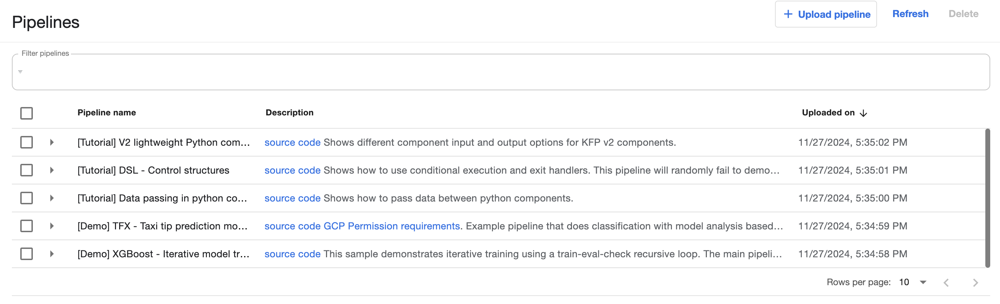
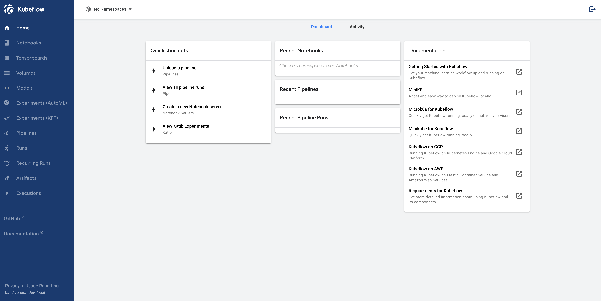
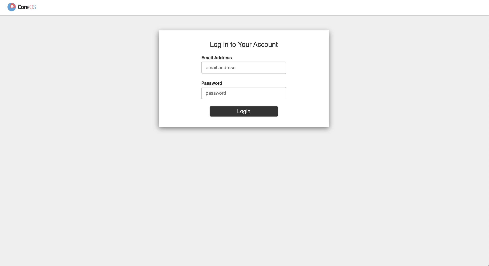
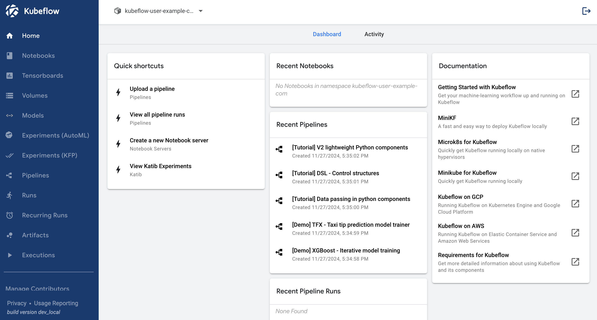

## 1. Prepare Setup File
We will use `Kubeflow v1.4.0` in this project. Clone [kubeflow/manifests Repository] repo and checkout to v1.4.

```bash
$ git clone -b v1.4-branch https://github.com/kubeflow/manifests.git
$ cd manifests
```


## 2. Install Cert-manager
[Cert-Manager] is a widely-used Kubernetes operator that declaratively manages TLS certificates using Kubernetes resources.

1) Install cert-manager
    ```bash
    $ kustomize build common/cert-manager/cert-manager/base | kubectl apply -f -
    ```
    
2) Wait until all 3-pods of cert-manager are running
    ```bash
    $ kubectl get pod -n cert-manager

    # expected outputs
    NAME                                       READY   STATUS    RESTARTS   AGE
    cert-manager-webhook-6b57b9b886-srxvh      1/1     Running   0          28s
    cert-manager-cainjector-64c949654c-t8cng   1/1     Running   0          28s
    cert-manager-7dd5854bb4-25kcj              1/1     Running   0          28s
    ```

3) Install kubeflow-issuer (manage the lifecycle of TLS certificates with cert-manager)
    ```bash
    $ kustomize build common/cert-manager/kubeflow-issuer/base | kubectl apply -f -

    # expected outputs
    clusterissuer.cert-manager.io/kubeflow-self-signing-issuer created
    ```


## 3. Install Istio
[Istio] addresses the challenges developers and operators face with a distributed or microservices architecture. Whether you’re building from scratch or migrating existing applications to cloud native, Istio can help.

1) Install istio related Customer Resource Definition (CRD)
    ```bash
    $ kustomize build common/istio-1-9/istio-crds/base | kubectl apply -f -

    # expected outputs
    Warning: apiextensions.k8s.io/v1beta1 CustomResourceDefinition is deprecated in v1.16+, unavailable in v1.22+; use apiextensions.k8s.io/v1 CustomResourceDefinition
    customresourcedefinition.apiextensions.k8s.io/authorizationpolicies.security.istio.io created
    customresourcedefinition.apiextensions.k8s.io/destinationrules.networking.istio.io created
    customresourcedefinition.apiextensions.k8s.io/envoyfilters.networking.istio.io created
    customresourcedefinition.apiextensions.k8s.io/gateways.networking.istio.io created
    customresourcedefinition.apiextensions.k8s.io/istiooperators.install.istio.io created
    customresourcedefinition.apiextensions.k8s.io/peerauthentications.security.istio.io created
    customresourcedefinition.apiextensions.k8s.io/requestauthentications.security.istio.io created
    customresourcedefinition.apiextensions.k8s.io/serviceentries.networking.istio.io created
    customresourcedefinition.apiextensions.k8s.io/sidecars.networking.istio.io created
    customresourcedefinition.apiextensions.k8s.io/virtualservices.networking.istio.io created
    customresourcedefinition.apiextensions.k8s.io/workloadentries.networking.istio.io created
    customresourcedefinition.apiextensions.k8s.io/workloadgroups.networking.istio.io created
    ```

2) Install istio namespace
    ```bash
    $ kustomize build common/istio-1-9/istio-namespace/base | kubectl apply -f -

    # expected outputs
    namespace/istio-system created
    ```

3) Install istio
    ```bash
    $ kustomize build common/istio-1-9/istio-install/base | kubectl apply -f -

    # expected outputs
    # Warning: 'patchesStrategicMerge' is deprecated. Please use 'patches' instead. Run 'kustomize edit fix' to update your Kustomization automatically.
    serviceaccount/istio-ingressgateway-service-account created
    serviceaccount/istio-reader-service-account created
    serviceaccount/istiod-service-account created
    role.rbac.authorization.k8s.io/istio-ingressgateway-sds created
    role.rbac.authorization.k8s.io/istiod-istio-system created
    clusterrole.rbac.authorization.k8s.io/istio-reader-istio-system created
    clusterrole.rbac.authorization.k8s.io/istiod-istio-system created
    rolebinding.rbac.authorization.k8s.io/istio-ingressgateway-sds created
    rolebinding.rbac.authorization.k8s.io/istiod-istio-system created
    clusterrolebinding.rbac.authorization.k8s.io/istio-reader-istio-system created
    clusterrolebinding.rbac.authorization.k8s.io/istiod-istio-system created
    configmap/istio created
    configmap/istio-sidecar-injector created
    service/istio-ingressgateway created
    service/istiod created
    deployment.apps/istio-ingressgateway created
    deployment.apps/istiod created
    envoyfilter.networking.istio.io/metadata-exchange-1.8 created
    envoyfilter.networking.istio.io/metadata-exchange-1.9 created
    envoyfilter.networking.istio.io/stats-filter-1.8 created
    envoyfilter.networking.istio.io/stats-filter-1.9 created
    envoyfilter.networking.istio.io/tcp-metadata-exchange-1.8 created
    envoyfilter.networking.istio.io/tcp-metadata-exchange-1.9 created
    envoyfilter.networking.istio.io/tcp-stats-filter-1.8 created
    envoyfilter.networking.istio.io/tcp-stats-filter-1.9 created
    envoyfilter.networking.istio.io/x-forwarded-host created
    gateway.networking.istio.io/istio-ingressgateway created
    authorizationpolicy.security.istio.io/global-deny-all created
    authorizationpolicy.security.istio.io/istio-ingressgateway created
    Warning: admissionregistration.k8s.io/v1beta1 MutatingWebhookConfiguration is deprecated in v1.16+, unavailable in v1.22+; use admissionregistration.k8s.io/v1 MutatingWebhookConfiguration
    mutatingwebhookconfiguration.admissionregistration.k8s.io/istio-sidecar-injector created
    Warning: admissionregistration.k8s.io/v1beta1 ValidatingWebhookConfiguration is deprecated in v1.16+, unavailable in v1.22+; use admissionregistration.k8s.io/v1 ValidatingWebhookConfiguration
    validatingwebhookconfiguration.admissionregistration.k8s.io/istiod-istio-system created
    ```

4) Wait until all 2-pods of istio-system namespace are running
    ```bash
    $ kubectl get pod -n istio-system

    # expected outputs
    NAME                                   READY   STATUS    RESTARTS   AGE
    istiod-86457659bb-6wbd9                1/1     Running   0          35s
    istio-ingressgateway-79b665c95-tb47n   1/1     Running   0          35s
    ```

## 4. Install Dex
[Dex] is an identity service that uses OpenID Connect to drive authentication for other apps.

Dex acts as a portal to other identity providers through "connectors." This lets dex defer authentication to LDAP servers, SAML providers, or established identity providers like GitHub, Google, and Active Directory. Clients write their authentication logic once to talk to dex, then dex handles the protocols for a given backend.

1) Install dex
    ```bash
    $ kustomize build common/dex/overlays/istio | kubectl apply -f -

    # expected outputs
    # Warning: 'vars' is deprecated. Please use 'replacements' instead. [EXPERIMENTAL] Run 'kustomize edit fix' to update your Kustomization automatically.
    namespace/auth created
    Warning: apiextensions.k8s.io/v1beta1 CustomResourceDefinition is deprecated in v1.16+, unavailable in v1.22+; use apiextensions.k8s.io/v1 CustomResourceDefinition
    customresourcedefinition.apiextensions.k8s.io/authcodes.dex.coreos.com created
    serviceaccount/dex created
    Warning: rbac.authorization.k8s.io/v1beta1 ClusterRole is deprecated in v1.17+, unavailable in v1.22+; use rbac.authorization.k8s.io/v1 ClusterRole
    clusterrole.rbac.authorization.k8s.io/dex created
    Warning: rbac.authorization.k8s.io/v1beta1 ClusterRoleBinding is deprecated in v1.17+, unavailable in v1.22+; use rbac.authorization.k8s.io/v1 ClusterRoleBinding
    clusterrolebinding.rbac.authorization.k8s.io/dex created
    configmap/dex created
    secret/dex-oidc-client created
    service/dex created
    deployment.apps/dex created
    virtualservice.networking.istio.io/dex created
    ```

2) Wait until 1-pod of auth namespace are running
    ```bash
    $ kubectl get pod -n auth

    # expected outputs
    NAME                   READY   STATUS    RESTARTS   AGE
    dex-5ddf47d88d-frw8t   1/1     Running   1          45s
    ```

## 5. Install OIDC AuthService

1) Install OIDC AuthService 
    ```bash
    $ kustomize build common/oidc-authservice/base | kubectl apply -f -

    # expected outputs
    # Warning: 'vars' is deprecated. Please use 'replacements' instead. [EXPERIMENTAL] Run 'kustomize edit fix' to update your Kustomization automatically.
    configmap/oidc-authservice-parameters created
    secret/oidc-authservice-client created
    service/authservice created
    persistentvolumeclaim/authservice-pvc created
    statefulset.apps/authservice created
    envoyfilter.networking.istio.io/authn-filter created
    ```

2) Wait until all 3-pods including `authservice-0 pod` are running
    ```bash
    $ kubectl get pod -n istio-system -w

    # expected outputs
    NAME                                   READY   STATUS    RESTARTS   AGE
    istiod-86457659bb-6wbd9                1/1     Running   0          35m
    istio-ingressgateway-79b665c95-tb47n   1/1     Running   0          35m
    authservice-0                          1/1     Running   0          66s
    ```

3) If `authservice-0` image pull failed

    ```bash
    # check pod status
    $ kubectl describe pod authservice-0 -n istio-system

    # in my case
    Events:
      Type     Reason     Age                   From               Message
      ----     ------     ----                  ----               -------
      Normal   Scheduled  8m3s                  default-scheduler  Successfully assigned istio-system/authservice-0 to ygene2-system-product-name
      Normal   Pulling    6m21s (x4 over 8m2s)  kubelet            Pulling image "gcr.io/arrikto/kubeflow/oidc-authservice:28c59ef"
      Warning  Failed     6m20s (x4 over 8m)    kubelet            Failed to pull image "gcr.io/arrikto/kubeflow/oidc-authservice:28c59ef": rpc error: code = Unknown desc = Error response from daemon: unauthorized: You dont have the needed permissions to perform this operation, and you may have invalid credentials. To authenticate your request, follow the steps in: https://cloud.google.com/container-registry/docs/advanced-authentication
      Warning  Failed     6m20s (x4 over 8m)    kubelet            Error: ErrImagePull
      Warning  Failed     6m7s (x6 over 8m)     kubelet            Error: ImagePullBackOff
      Normal   BackOff    2m53s (x20 over 8m)   kubelet            Back-off pulling image "gcr.io/arrikto/kubeflow/oidc-authservice:28c59ef"

    # check image path and tag
    $ vi common/oidc-authservice/base/kustomization.yaml

    # modify kustomization.yaml as follows
    images:
    - name: gcr.io/arrikto/kubeflow/oidc-authservice
      # newName: gcr.io/arrikto/kubeflow/oidc-authservice
      newName: docker.io/kubeflowmanifestswg/oidc-authservice
      newTag: 28c59ef

    # delete `authservice-0` pod and restart
    $ kubectl delete pod authservice-0 -n istio-system
    ```

## 6. Create Kubeflow Namespace
1) Create Kubeflow Namespace
    ```bash
    $ kustomize build common/kubeflow-namespace/base | kubectl apply -f -

    # expected outputs
    namespace/kubeflow created
    ```

2) Check if the kubeflow namespace is active
    ```bash
    $ kubectl get ns kubeflow

    # expected outputs
    NAME       STATUS   AGE
    kubeflow   Active   31s
    ```

## 7. Install Kubeflow Roles

1) Install kubeflow-roles
    ```bash
    $ kustomize build common/kubeflow-roles/base | kubectl apply -f -

    # expected outputs
    clusterrole.rbac.authorization.k8s.io/kubeflow-admin created
    clusterrole.rbac.authorization.k8s.io/kubeflow-edit created
    clusterrole.rbac.authorization.k8s.io/kubeflow-kubernetes-admin created
    clusterrole.rbac.authorization.k8s.io/kubeflow-kubernetes-edit created
    clusterrole.rbac.authorization.k8s.io/kubeflow-kubernetes-view created
    clusterrole.rbac.authorization.k8s.io/kubeflow-view created
    ```

2) Check if all 6-roles are created
    ```bash
    $ kubectl get clusterrole | grep kubeflow

    # expected outputs
    kubeflow-kubernetes-admin                                              2024-11-27T08:04:56Z
    kubeflow-kubernetes-edit                                               2024-11-27T08:04:56Z
    kubeflow-kubernetes-view                                               2024-11-27T08:04:56Z
    kubeflow-view                                                          2024-11-27T08:04:56Z
    kubeflow-edit                                                          2024-11-27T08:04:56Z
    kubeflow-admin                                                         2024-11-27T08:04:56Z
    ```

## 8. Install Kubeflow Istio Resources

1) Install kubeflow-istio-resources
    ```bash
    $ kustomize build common/istio-1-9/kubeflow-istio-resources/base | kubectl apply -f -

    # expected outputs
    clusterrole.rbac.authorization.k8s.io/kubeflow-istio-admin created
    clusterrole.rbac.authorization.k8s.io/kubeflow-istio-edit created
    clusterrole.rbac.authorization.k8s.io/kubeflow-istio-view created
    gateway.networking.istio.io/kubeflow-gateway created
    ```

2) Check if all 3 kubeflow-istio roles are created
    ```bash
    $ kubectl get clusterrole | grep kubeflow-istio

    # expected outputs
    kubeflow-istio-edit                                                    2024-11-27T08:07:51Z
    kubeflow-istio-admin                                                   2024-11-27T08:07:51Z
    kubeflow-istio-view                                                    2024-11-27T08:07:51Z
    ```

3) Check if kubeflow-gateway installed in the namespace
    ```bash
    $ kubectl get gateway -n kubeflow

    # expected outputs
    NAME               AGE
    kubeflow-gateway   87s
    ```

## 9. Install Kubeflow Pipelines

1) Install kubeflow pipeline
    ```bash
    $ kustomize build apps/pipeline/upstream/env/platform-agnostic-multi-user | kubectl apply -f -

    # expected outputs
    ```

2) If the build fails with the following error (`"STDIN": error validating data: ValidationError(CustomResourceDefinition)`)
    ```bash
    # Warning: 'patchesStrategicMerge' is deprecated. Please use 'patches' instead. Run 'kustomize edit fix' to update your Kustomization automatically.
    # Warning: 'bases' is deprecated. Please use 'resources' instead. Run 'kustomize edit fix' to update your Kustomization automatically.
    # Warning: 'vars' is deprecated. Please use 'replacements' instead. [EXPERIMENTAL] Run 'kustomize edit fix' to update your Kustomization automatically.
    # Warning: 'bases' is deprecated. Please use 'resources' instead. Run 'kustomize edit fix' to update your Kustomization automatically.
    # Warning: 'bases' is deprecated. Please use 'resources' instead. Run 'kustomize edit fix' to update your Kustomization automatically.
    # Warning: 'patchesJson6902' is deprecated. Please use 'patches' instead. Run 'kustomize edit fix' to update your Kustomization automatically.
    # Warning: 'bases' is deprecated. Please use 'resources' instead. Run 'kustomize edit fix' to update your Kustomization automatically.
    # Warning: 'patchesStrategicMerge' is deprecated. Please use 'patches' instead. Run 'kustomize edit fix' to update your Kustomization automatically.
    error: error validating "STDIN": error validating data: ValidationError(CustomResourceDefinition): unknown field "2024/11/27 17:24:38 well-defined vars that were never replaced" in io.k8s.apiextensions-apiserver.pkg.apis.apiextensions.v1.CustomResourceDefinition; if you choose to ignore these errors, turn validation off with --validate=false
    ```
    
    If you'are using kustomize `v5.0.0`, upgrade kustomize version and reinstall kubeflow pipeline.  
    (see this issue: https://github.com/kubeflow/manifests/issues/2397)
    ```
    $ kustomize version

    # expected outputs
    v5.0.0

    # run commands below on the client
    $ wget https://github.com/kubernetes-sigs/kustomize/releases/download/kustomize%2Fv5.2.1/kustomize_v5.2.1_darwin_arm64.tar.gz
    $ tar -xzvf kustomize_v5.2.1_darwin_arm64.tar.gz
    $ sudo mv kustomize /usr/local/bin/kustomize
    ```


3) If the build fails with the following error (`"STDIN": no matches for kind "CompositeController"`)
    ```bash
    error: unable to recognize "STDIN": no matches for kind "CompositeController" in version "metacontroller.k8s.io/v1alpha1"
    ```

    This error can be caused by the install order dependencies between resources. Wait a few seconds and reinstall kubeflow pipeline.

4) Wait until all 16-pods are running
    ```
    $ kubectl get pod -n kubeflow

    NAME                                                     READY   STATUS    RESTARTS   AGE
    metadata-envoy-deployment-5b4856dd5-hmst9                1/1     Running   0          13m
    kubeflow-pipelines-profile-controller-69596b78cc-46qsj   1/1     Running   0          13m
    metacontroller-0                                         1/1     Running   0          13m
    metadata-writer-548bd879bb-zznv4                         2/2     Running   1          13m
    ml-pipeline-scheduledworkflow-5db54d75c5-h5nm5           2/2     Running   0          13m
    ml-pipeline-persistenceagent-d6bdc77bd-srfgf             2/2     Running   0          13m
    ml-pipeline-ui-5bd8d6dc84-8ktxm                          2/2     Running   0          13m
    ml-pipeline-visualizationserver-8476b5c645-8c5mw         2/2     Running   0          13m
    workflow-controller-5cbbb49bd8-pz4vg                     2/2     Running   1          13m
    mysql-f7b9b7dd4-vlzf9                                    2/2     Running   0          13m
    minio-5b65df66c9-t7nbt                                   2/2     Running   0          13m
    cache-deployer-deployment-79fdf9c5c9-tdqh4               2/2     Running   1          13m
    ml-pipeline-viewer-crd-68fb5f4d58-k2fqh                  2/2     Running   1          13m
    metadata-grpc-deployment-6b5685488-bp5z4                 2/2     Running   3          13m
    ml-pipeline-847f9d7f78-r8h9m                             2/2     Running   1          13m
    cache-server-6566dc7dbf-hwttk                            2/2     Running   0          13m
    ```

5) Check if the ml-pipeline UI is connected properly
    ```bash
    # port-forwarding
    $ kubectl port-forward svc/ml-pipeline-ui -n kubeflow 8888:80

    # open browser and check if the figure below is printed
    http://localhost:8888/#/pipelines/
    ```

    

## 10. Install Katib

[Katib] is a Kubernetes-native project for automated machine learning (AutoML). Katib supports hyperparameter tuning, early stopping and neural architecture search (NAS). Learn more about AutoML at fast.ai, Google Cloud, Microsoft Azure or Amazon SageMaker.

1) Install Katib
    ```bash
    $ kustomize build apps/katib/upstream/installs/katib-with-kubeflow | kubectl apply -f -

    # expected outputs
    # Warning: 'patchesStrategicMerge' is deprecated. Please use 'patches' instead. Run 'kustomize edit fix' to update your Kustomization automatically.
    # Warning: 'vars' is deprecated. Please use 'replacements' instead. [EXPERIMENTAL] Run 'kustomize edit fix' to update your Kustomization automatically.
    # Warning: 'patchesStrategicMerge' is deprecated. Please use 'patches' instead. Run 'kustomize edit fix' to update your Kustomization automatically.
    # Warning: 'vars' is deprecated. Please use 'replacements' instead. [EXPERIMENTAL] Run 'kustomize edit fix' to update your Kustomization automatically.
    customresourcedefinition.apiextensions.k8s.io/experiments.kubeflow.org created
    customresourcedefinition.apiextensions.k8s.io/suggestions.kubeflow.org created
    customresourcedefinition.apiextensions.k8s.io/trials.kubeflow.org created
    serviceaccount/katib-controller created
    serviceaccount/katib-ui created
    clusterrole.rbac.authorization.k8s.io/katib-controller created
    clusterrole.rbac.authorization.k8s.io/katib-ui created
    clusterrole.rbac.authorization.k8s.io/kubeflow-katib-admin created
    clusterrole.rbac.authorization.k8s.io/kubeflow-katib-edit created
    clusterrole.rbac.authorization.k8s.io/kubeflow-katib-view created
    clusterrolebinding.rbac.authorization.k8s.io/katib-controller created
    clusterrolebinding.rbac.authorization.k8s.io/katib-ui created
    configmap/katib-config created
    configmap/trial-templates created
    secret/katib-mysql-secrets created
    service/katib-controller created
    service/katib-db-manager created
    service/katib-mysql created
    service/katib-ui created
    persistentvolumeclaim/katib-mysql created
    deployment.apps/katib-controller created
    deployment.apps/katib-db-manager created
    deployment.apps/katib-mysql created
    deployment.apps/katib-ui created
    certificate.cert-manager.io/katib-webhook-cert created
    issuer.cert-manager.io/katib-selfsigned-issuer created
    virtualservice.networking.istio.io/katib-ui created
    mutatingwebhookconfiguration.admissionregistration.k8s.io/katib.kubeflow.org created
    validatingwebhookconfiguration.admissionregistration.k8s.io/katib.kubeflow.org created
    ```

2) Check if all 4-pods are running
    ```bash
    $ kubectl get po -n kubeflow | grep katib

    # expected outputs
    katib-db-manager-6c948b6b76-59t2k                        1/1     Running   0          80s
    katib-controller-68c47fbf8b-kfnvg                        1/1     Running   0          80s
    katib-ui-64bb96d5bf-w9srd                                1/1     Running   0          80s
    katib-mysql-7894994f88-w455x                             1/1     Running   0          80s
    ```

3) Check if the katib UI is connected properly
    ```bash
    # port-forwarding
    $ kubectl port-forward svc/katib-ui -n kubeflow 8081:80

    # open browser and check if the figure below is printed
    http://localhost:8081/katib/
    ```

    

## 11. Install Central Dashboard

1) Install Dashboard
    ```bash
    $ kustomize build apps/centraldashboard/upstream/overlays/istio | kubectl apply -f -

    # expected outputs
    # Warning: 'vars' is deprecated. Please use 'replacements' instead. [EXPERIMENTAL] Run 'kustomize edit fix' to update your Kustomization automatically.
    serviceaccount/centraldashboard created
    role.rbac.authorization.k8s.io/centraldashboard created
    clusterrole.rbac.authorization.k8s.io/centraldashboard created
    rolebinding.rbac.authorization.k8s.io/centraldashboard created
    clusterrolebinding.rbac.authorization.k8s.io/centraldashboard created
    configmap/centraldashboard-config created
    configmap/centraldashboard-parameters created
    service/centraldashboard created
    deployment.apps/centraldashboard created
    virtualservice.networking.istio.io/centraldashboard created
    ```

2) Wait until the centraldashboard pod is running
    ```bash
    $ kubectl get po -n kubeflow | grep centraldashboard

    # expected outputs
    centraldashboard-8fc7d8cc-22xqr                          1/1     Running   0          19s
    ```

3) Check if the Central Dashboard UI is connected properly
    ```bash
    # port-forwarding
    $ kubectl port-forward svc/centraldashboard -n kubeflow 8082:80

    # open browser and check if the figure below is printed
    # (ignore "Unable to contact profile controller" message, we will install the profile controller later in section 1-14)
    http://localhost:8082/
    ```

    


## 12. Install Admission Webhook

1) Install Admission Webhook
    ```bash
    $ kustomize build apps/admission-webhook/upstream/overlays/cert-manager | kubectl apply -f -

    # expected outputs
    # Warning: 'bases' is deprecated. Please use 'resources' instead. Run 'kustomize edit fix' to update your Kustomization automatically.
    # Warning: 'patchesStrategicMerge' is deprecated. Please use 'patches' instead. Run 'kustomize edit fix' to update your Kustomization automatically.
    # Warning: 'vars' is deprecated. Please use 'replacements' instead. [EXPERIMENTAL] Run 'kustomize edit fix' to update your Kustomization automatically.
    # Warning: 'vars' is deprecated. Please use 'replacements' instead. [EXPERIMENTAL] Run 'kustomize edit fix' to update your Kustomization automatically.
    Warning: apiextensions.k8s.io/v1beta1 CustomResourceDefinition is deprecated in v1.16+, unavailable in v1.22+; use apiextensions.k8s.io/v1 CustomResourceDefinition
    customresourcedefinition.apiextensions.k8s.io/poddefaults.kubeflow.org created
    serviceaccount/admission-webhook-service-account created
    clusterrole.rbac.authorization.k8s.io/admission-webhook-cluster-role created
    clusterrole.rbac.authorization.k8s.io/admission-webhook-kubeflow-poddefaults-admin created
    clusterrole.rbac.authorization.k8s.io/admission-webhook-kubeflow-poddefaults-edit created
    clusterrole.rbac.authorization.k8s.io/admission-webhook-kubeflow-poddefaults-view created
    clusterrolebinding.rbac.authorization.k8s.io/admission-webhook-cluster-role-binding created
    service/admission-webhook-service created
    deployment.apps/admission-webhook-deployment created
    certificate.cert-manager.io/admission-webhook-cert created
    issuer.cert-manager.io/admission-webhook-selfsigned-issuer created
    Warning: admissionregistration.k8s.io/v1beta1 MutatingWebhookConfiguration is deprecated in v1.16+, unavailable in v1.22+; use admissionregistration.k8s.io/v1 MutatingWebhookConfiguration
    mutatingwebhookconfiguration.admissionregistration.k8s.io/admission-webhook-mutating-webhook-configuration created
    ```

2) Wait until the admission-webhook pod is running
    ```bash
    $ kubectl get po -n kubeflow | grep admission-webhook

    # expected outputs
    admission-webhook-deployment-667bd68d94-sgl9h            1/1     Running   0          22s
    ```

## 13. Install Notebooks & Jupyter Web App

1) Install Notebook controller
    ```bash
    $ kustomize build apps/jupyter/notebook-controller/upstream/overlays/kubeflow | kubectl apply -f -

    # expected outputs
    # Warning: 'patchesStrategicMerge' is deprecated. Please use 'patches' instead. Run 'kustomize edit fix' to update your Kustomization automatically.
    # Warning: 'bases' is deprecated. Please use 'resources' instead. Run 'kustomize edit fix' to update your Kustomization automatically.
    # Warning: 'patchesJson6902' is deprecated. Please use 'patches' instead. Run 'kustomize edit fix' to update your Kustomization automatically.
    # Warning: 'patchesStrategicMerge' is deprecated. Please use 'patches' instead. Run 'kustomize edit fix' to update your Kustomization automatically.
    Warning: apiextensions.k8s.io/v1beta1 CustomResourceDefinition is deprecated in v1.16+, unavailable in v1.22+; use apiextensions.k8s.io/v1 CustomResourceDefinition
    customresourcedefinition.apiextensions.k8s.io/notebooks.kubeflow.org created
    serviceaccount/notebook-controller-service-account created
    role.rbac.authorization.k8s.io/notebook-controller-leader-election-role created
    clusterrole.rbac.authorization.k8s.io/notebook-controller-kubeflow-notebooks-admin created
    clusterrole.rbac.authorization.k8s.io/notebook-controller-kubeflow-notebooks-edit created
    clusterrole.rbac.authorization.k8s.io/notebook-controller-kubeflow-notebooks-view created
    clusterrole.rbac.authorization.k8s.io/notebook-controller-role created
    rolebinding.rbac.authorization.k8s.io/notebook-controller-leader-election-rolebinding created
    clusterrolebinding.rbac.authorization.k8s.io/notebook-controller-role-binding created
    configmap/notebook-controller-config-m44cmb547t created
    service/notebook-controller-service created
    deployment.apps/notebook-controller-deployment created
    ```

2) Wait until notebook-controller pod is running
    ```bash
    $ kubectl get po -n kubeflow | grep notebook-controller

    # expected outputs
    notebook-controller-deployment-6b75d45f48-7zqxm          1/1     Running   0          16s
    ```

3) Install Jupyter Web App
    ```bash
    $ kustomize build apps/jupyter/jupyter-web-app/upstream/overlays/istio | kubectl apply -f -

    # expected outputs
    # Warning: 'vars' is deprecated. Please use 'replacements' instead. [EXPERIMENTAL] Run 'kustomize edit fix' to update your Kustomization automatically.
    serviceaccount/jupyter-web-app-service-account created
    Warning: rbac.authorization.k8s.io/v1beta1 Role is deprecated in v1.17+, unavailable in v1.22+; use rbac.authorization.k8s.io/v1 Role
    role.rbac.authorization.k8s.io/jupyter-web-app-jupyter-notebook-role created
    clusterrole.rbac.authorization.k8s.io/jupyter-web-app-cluster-role created
    clusterrole.rbac.authorization.k8s.io/jupyter-web-app-kubeflow-notebook-ui-admin created
    clusterrole.rbac.authorization.k8s.io/jupyter-web-app-kubeflow-notebook-ui-edit created
    clusterrole.rbac.authorization.k8s.io/jupyter-web-app-kubeflow-notebook-ui-view created
    Warning: rbac.authorization.k8s.io/v1beta1 RoleBinding is deprecated in v1.17+, unavailable in v1.22+; use rbac.authorization.k8s.io/v1 RoleBinding
    rolebinding.rbac.authorization.k8s.io/jupyter-web-app-jupyter-notebook-role-binding created
    clusterrolebinding.rbac.authorization.k8s.io/jupyter-web-app-cluster-role-binding created
    configmap/jupyter-web-app-config-76844k4cd7 created
    configmap/jupyter-web-app-logos created
    configmap/jupyter-web-app-parameters-chmg88cm48 created
    service/jupyter-web-app-service created
    deployment.apps/jupyter-web-app-deployment created
    virtualservice.networking.istio.io/jupyter-web-app-jupyter-web-app created
    ```

4) Wait until jupyter-web-app pod is running
    ```bash
    $ kubectl get po -n kubeflow | grep jupyter-web-app

    # expected outputs
    jupyter-web-app-deployment-84c459d4cd-5kfd4              1/1     Running   0          15s
    ```


## 14. Install Profiles + KFAM

1) Install Profile Controller
    ```bash
    $ kustomize build apps/profiles/upstream/overlays/kubeflow | kubectl apply -f -

    # expected outputs
    customresourcedefinition.apiextensions.k8s.io/profiles.kubeflow.org created
    serviceaccount/profiles-controller-service-account created
    role.rbac.authorization.k8s.io/profiles-leader-election-role created
    rolebinding.rbac.authorization.k8s.io/profiles-leader-election-rolebinding created
    clusterrolebinding.rbac.authorization.k8s.io/profiles-cluster-role-binding created
    configmap/namespace-labels-data-48h7kd55mc created
    configmap/profiles-config-46c7tgh6fd created
    service/profiles-kfam created
    deployment.apps/profiles-deployment created
    virtualservice.networking.istio.io/profiles-kfam created
    ```

2) Wait until profile-deployment pod is running
    ```bash
    $ kubectl get po -n kubeflow | grep profiles-deployment

    # expected outputs
    profiles-deployment-58d7c94845-5pp5h                     2/2     Running   0          20s
    ```

## 15. Install Volumes Web App

1) Install Volumes Web App
    ```bash
    $ kustomize build apps/volumes-web-app/upstream/overlays/istio | kubectl apply -f -

    # expected outputs
    # Warning: 'vars' is deprecated. Please use 'replacements' instead. [EXPERIMENTAL] Run 'kustomize edit fix' to update your Kustomization automatically.
    serviceaccount/volumes-web-app-service-account created
    clusterrole.rbac.authorization.k8s.io/volumes-web-app-cluster-role created
    clusterrole.rbac.authorization.k8s.io/volumes-web-app-kubeflow-volume-ui-admin created
    clusterrole.rbac.authorization.k8s.io/volumes-web-app-kubeflow-volume-ui-edit created
    clusterrole.rbac.authorization.k8s.io/volumes-web-app-kubeflow-volume-ui-view created
    clusterrolebinding.rbac.authorization.k8s.io/volumes-web-app-cluster-role-binding created
    configmap/volumes-web-app-parameters-4gg8cm2gmk created
    service/volumes-web-app-service created
    deployment.apps/volumes-web-app-deployment created
    virtualservice.networking.istio.io/volumes-web-app-volumes-web-app created
    ```

2) Wait until volumes-web-app pod is running
    ```bash
    $ kubectl get po -n kubeflow | grep volumes-web-app

    # expected outputs
    volumes-web-app-deployment-8589d664cc-9qsfb              1/1     Running   0          15s
    ```

## 16. Install Tensorboard & Tensorboard Web App

1) Install Tensorboard Web App
    ```bash
    $ kustomize build apps/tensorboard/tensorboards-web-app/upstream/overlays/istio | kubectl apply -f -

    # expected outputs
    # Warning: 'vars' is deprecated. Please use 'replacements' instead. [EXPERIMENTAL] Run 'kustomize edit fix' to update your Kustomization automatically.
    serviceaccount/tensorboards-web-app-service-account created
    clusterrole.rbac.authorization.k8s.io/tensorboards-web-app-cluster-role created
    clusterrole.rbac.authorization.k8s.io/tensorboards-web-app-kubeflow-tensorboard-ui-admin created
    clusterrole.rbac.authorization.k8s.io/tensorboards-web-app-kubeflow-tensorboard-ui-edit created
    clusterrole.rbac.authorization.k8s.io/tensorboards-web-app-kubeflow-tensorboard-ui-view created
    clusterrolebinding.rbac.authorization.k8s.io/tensorboards-web-app-cluster-role-binding created
    configmap/tensorboards-web-app-parameters-g28fbd6cch created
    service/tensorboards-web-app-service created
    deployment.apps/tensorboards-web-app-deployment created
    virtualservice.networking.istio.io/tensorboards-web-app-tensorboards-web-app created
    ```

2) Wait until tensorboards-web-app pod is running
    ```bash
    $ kubectl get po -n kubeflow | grep tensorboards-web-app

    # expected outputs
    tensorboards-web-app-deployment-6ff79b7f44-6pcjv         1/1     Running   0          12s
    ```

3) Install Tensorboard Controller
    ```bash
    $ kustomize build apps/tensorboard/tensorboard-controller/upstream/overlays/kubeflow | kubectl apply -f -

    # expected outputs
    # Warning: 'patchesStrategicMerge' is deprecated. Please use 'patches' instead. Run 'kustomize edit fix' to update your Kustomization automatically.
    # Warning: 'patchesStrategicMerge' is deprecated. Please use 'patches' instead. Run 'kustomize edit fix' to update your Kustomization automatically.
    # Warning: 'bases' is deprecated. Please use 'resources' instead. Run 'kustomize edit fix' to update your Kustomization automatically.
    # Warning: 'patchesStrategicMerge' is deprecated. Please use 'patches' instead. Run 'kustomize edit fix' to update your Kustomization automatically.
    Warning: apiextensions.k8s.io/v1beta1 CustomResourceDefinition is deprecated in v1.16+, unavailable in v1.22+; use apiextensions.k8s.io/v1 CustomResourceDefinition
    customresourcedefinition.apiextensions.k8s.io/tensorboards.tensorboard.kubeflow.org created
    serviceaccount/tensorboard-controller created
    role.rbac.authorization.k8s.io/tensorboard-controller-leader-election-role created
    clusterrole.rbac.authorization.k8s.io/tensorboard-controller-manager-role created
    clusterrole.rbac.authorization.k8s.io/tensorboard-controller-proxy-role created
    rolebinding.rbac.authorization.k8s.io/tensorboard-controller-leader-election-rolebinding created
    clusterrolebinding.rbac.authorization.k8s.io/tensorboard-controller-manager-rolebinding created
    clusterrolebinding.rbac.authorization.k8s.io/tensorboard-controller-proxy-rolebinding created
    configmap/tensorboard-controller-config-bf88mm96c8 created
    service/tensorboard-controller-controller-manager-metrics-service created
    deployment.apps/tensorboard-controller-controller-manager created
    ```

4) Wait until tensorboard-controller pod is running
    ```bash
    $ kubectl get po -n kubeflow | grep tensorboard-controller

    # expected outputs
    tensorboard-controller-controller-manager-775777c4c5-5m6dj   3/3     Running   2          39s
    ```

## 17. Install Training Operator

1) Install Training Operator
    ```bash
    $ kustomize build apps/training-operator/upstream/overlays/kubeflow | kubectl apply -f -

    # expected outputs
    customresourcedefinition.apiextensions.k8s.io/mxjobs.kubeflow.org created
    customresourcedefinition.apiextensions.k8s.io/pytorchjobs.kubeflow.org created
    customresourcedefinition.apiextensions.k8s.io/tfjobs.kubeflow.org created
    customresourcedefinition.apiextensions.k8s.io/xgboostjobs.kubeflow.org created
    serviceaccount/training-operator created
    clusterrole.rbac.authorization.k8s.io/kubeflow-training-admin created
    clusterrole.rbac.authorization.k8s.io/kubeflow-training-edit created
    clusterrole.rbac.authorization.k8s.io/kubeflow-training-view created
    clusterrole.rbac.authorization.k8s.io/training-operator created
    clusterrolebinding.rbac.authorization.k8s.io/training-operator created
    service/training-operator created
    deployment.apps/training-operator created
    ```

2) Wait until training-operator pod is running
    ```bash
    $ kubectl get po -n kubeflow | grep training-operator

    # expected outputs
    training-operator-7d98f9dd88-97gnf                           1/1     Running   0          26s
    ```

## 18. Install User Namespace

1) Install User's Kubeflow Profile
    ```bash
    $ kustomize build common/user-namespace/base | kubectl apply -f -

    # expected outputs
    # Warning: 'vars' is deprecated. Please use 'replacements' instead. [EXPERIMENTAL] Run 'kustomize edit fix' to update your Kustomization automatically.
    configmap/default-install-config-9h2h2b6hbk created
    profile.kubeflow.org/kubeflow-user-example-com created
    ```

2) Check if the `kubeflow-user-example-com` profile is created
    ```bash
    $ kubectl get profile

    # expected outputs
    NAME                        AGE
    kubeflow-user-example-com   18s
    ```

3) Check if the Login UI is connected properly
    ```bash
    # port-forwarding
    $ kubectl port-forward svc/istio-ingressgateway -n istio-system 8080:80

    # open browser and check if the figure below is printed
    http://localhost:8080/
    ```

    

4) Login and check if the central dashboard UI appears
    ```bash
    Email: user@example.com
    Password: 12341234
    ```

    


## References
- [mlops-for-all with Kubeflow]
- [kubeflow/manifests Repository]
- [Cert-Manager] 
- [Istio]
- [Dex]
- [Katib]


[kubeflow/manifests Repository]: https://github.com/kubeflow/manifests
[Cert-Manager]: https://www.deploykf.org/guides/dependencies/cert-manager/
[Istio]: https://istio.io/latest/about/service-mesh/
[Dex]: https://github.com/dexidp/dex
[Katib]: https://www.kubeflow.org/docs/components/katib/overview/#what-is-katib-
[mlops-for-all with Kubeflow]: https://mlops-for-all.github.io/docs/introduction/intro
