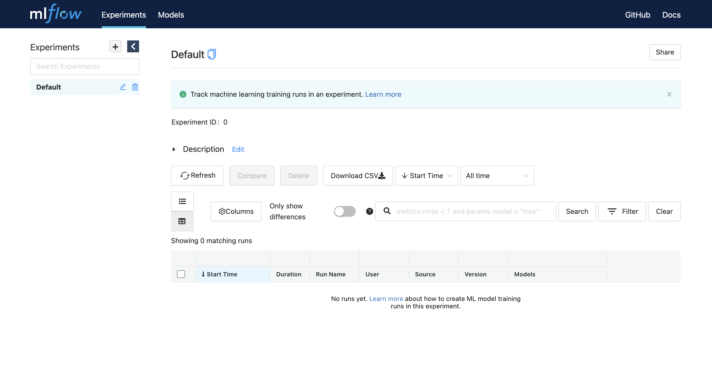

## 1. Install PostgreSQL DB

1) Create `mlflow-system` namespace
    ```bash
    $ kubectl create ns mlflow-system

    # expected outputs
    namespace/mlflow-system created
    ```

2) Create PostgreSQL DB in `mlflow-system` namespace
    ```bash
    $ kubectl -n mlflow-system apply -f https://raw.githubusercontent.com/mlops-for-all/helm-charts/b94b5fe4133f769c04b25068b98ccfa7a505aa60/mlflow/manifests/postgres.yaml

    # expected outputs
    service/postgresql-mlflow-service created
    deployment.apps/postgresql-mlflow created
    persistentvolumeclaim/postgresql-mlflow-pvc created
    ```

3) Wait until `postgres` related pod in `mlflow-system` namespace is runnning
    ```bash
    $ kubectl get pod -n mlflow-system | grep postgresql

    # expected outputs
    postgresql-mlflow-7b9bc8c79f-vfj8v   1/1     Running   0          27s
    ```


## 2. Setup MinIO
[MinIO] (Minimal Object Storage) is an open-source distributed storage solution. Note that we have already installed minio in [SETUP_KUBEFLOW.md].

1) Launch MinIO Browser
    ```
    $ kubectl port-forward svc/minio-service -n kubeflow 9000:9000

    # open browser
    http://localhost:9000/minio/login
    ```

    

2) Login MinIO Browser
    ```
    Access Key: minio
    Secret Key: minio123
    ```

3) Create `mlflow` Bucket

    


## 3. Install MLflow Tracking Server
MLflow tracking server is a stand-alone HTTP server that serves multiple REST API endpoints for tracking runs/experiments.

1) Add Helm Repository
    ```bash
    $ helm repo add mlops-for-all https://mlops-for-all.github.io/helm-charts

    # expected outputs
    "mlops-for-all" has been added to your repositories
    ```

2) Update Helm Repository
    ```bash
    $ helm repo update

    # expected outputs
    Hang tight while we grab the latest from your chart repositories...
    ...Successfully got an update from the "mlops-for-all" chart repository
    Update Complete. ⎈Happy Helming!⎈
    ```

3) Helm Install
    ```bash
    $ helm install mlflow-server mlops-for-all/mlflow-server \
        --namespace mlflow-system \
        --version 0.2.0

    # expected outputs
    NAME: mlflow-server
    LAST DEPLOYED: Thu Nov 28 18:41:24 2024
    NAMESPACE: mlflow-system
    STATUS: deployed
    REVISION: 1
    TEST SUITE: None
    ```

3) Wait until `mlflow-server` related pod in `mlflow-system` namespace is runnning
    ```
    $ kubectl get pod -n mlflow-system | grep mlflow-server

    # expected outputs
    mlflow-server-579bb577cd-hc5wv       1/1     Running   0          39s
    ```

4) Check if the MLflow Tracking Server is connected properly
    ```bash
    # port-forwarding
    $ kubectl port-forward svc/mlflow-server-service -n mlflow-system 5000:5000

    # open browser and check if the figure below is printed
    http://localhost:5000/
    ```

    


# References
- [MinIO]
- [SETUP_KUBEFLOW.md]
- [MLflow Tracking Server]


[MinIO]: https://min.io/
[SETUP_KUBEFLOW.md]: https://github.com/youjin2/mlops/blob/main/kubeflow/SETUP_KUBEFLOW.md
[MLflow Tracking Server]: https://mlflow.org/docs/latest/tracking/server.html


