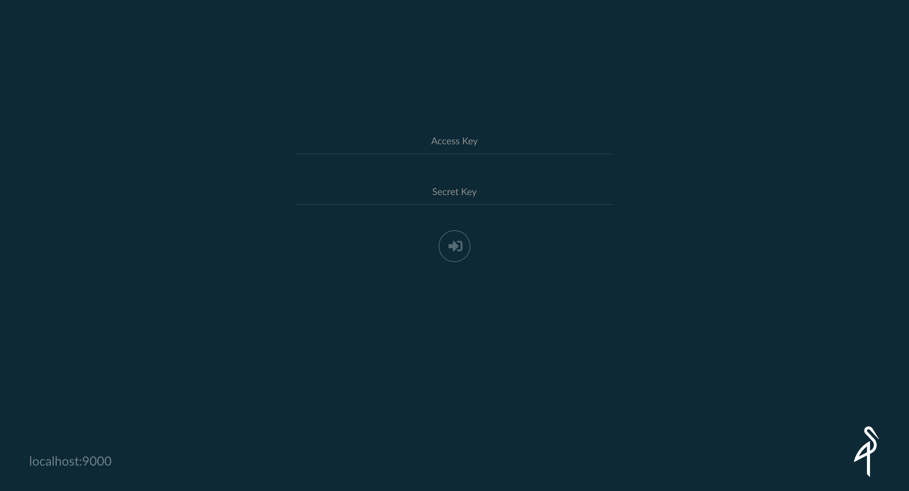
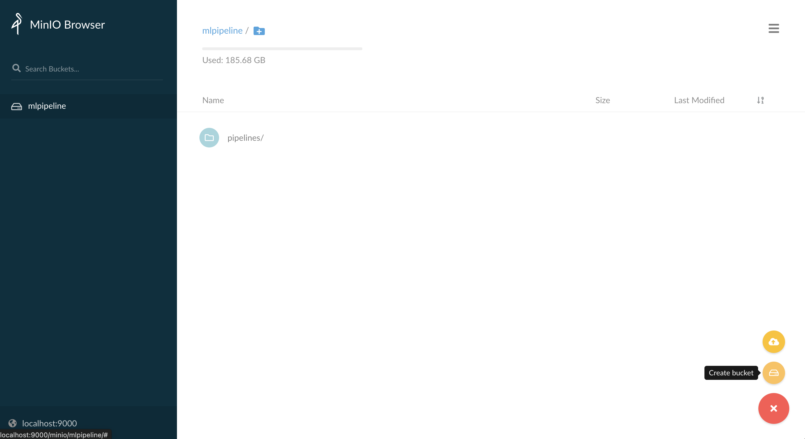

## 1. Install PostgreSQL DB

1) Create `mlflow-system` namespace
    ```bash
    $ kubectl create ns mlflow-system

    # expected outputs
    namespace/mlflow-system created
    ```

2) Create PostgreSQL DB in `mlflow-system` namespace
    ```bash
    $ kubectl -n mlflow-system apply -f https://raw.githubusercontent.com/mlops-for-all/helm-charts/b94b5fe4133f769c04b25068b98ccfa7a505aa60/mlflow/manifests/postgres.yaml

    # expected outputs
    service/postgresql-mlflow-service created
    deployment.apps/postgresql-mlflow created
    persistentvolumeclaim/postgresql-mlflow-pvc created
    ```

3) Wait until postgres related pod in `mlflow-system` namespace is runnning
    ```bash
    $ kubectl get pod -n mlflow-system | grep postgresql

    # expected outputs
    postgresql-mlflow-7b9bc8c79f-vfj8v   1/1     Running   0          27s
    ```


## 2. Setup MinIO
[MinIO] (Minimal Object Storage) is an open-source distributed storage solution. Note that we have already installed minio in [SETUP_KUBEFLOW.md].

1) Launch MinIO Browser
    ```
    $ kubectl port-forward svc/minio-service -n kubeflow 9000:9000

    # open browser
    http://localhost:9000/minio/login
    ```

    

2) Login MinIO Browser
    ```
    Access Key: minio
    Secret Key: minio123
    ```

3) Create `mlflow` Bucket

    


## 3.


## References
- [MinIO]
- [SETUP_KUBEFLOW.md]


[MinIO]: https://min.io/
[SETUP_KUBEFLOW.md]: https://github.com/youjin2/mlops/blob/main/kubeflow/SETUP_KUBEFLOW.md


1) 
    ```bash
    $ 

    # expected outputs
    ```

2) 
    ```bash
    $

    # expected outputs
    ```

3) 
    ```bash
    $

    # expected outputs
    ```

4) 
    ```bash
    $

    # expected outputs
    ```
