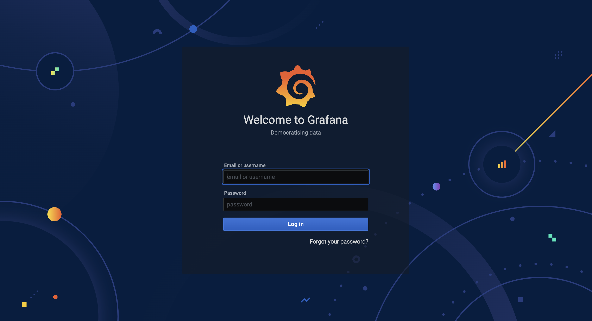
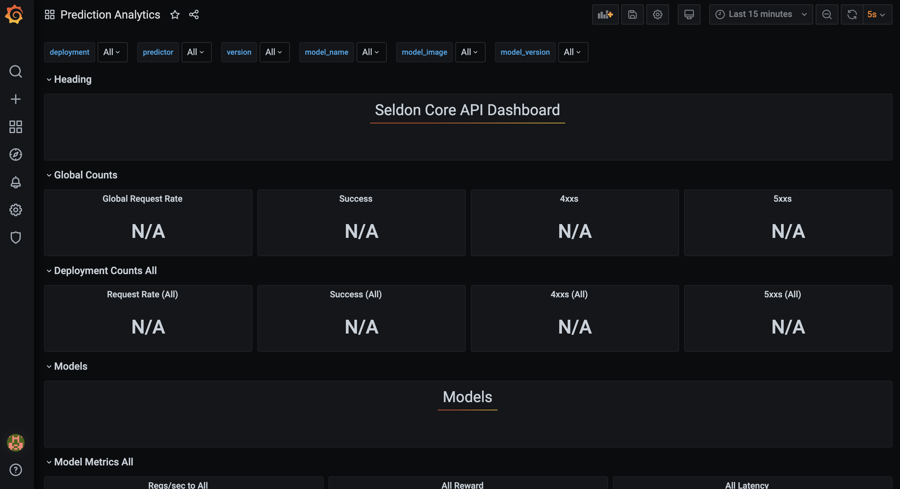

## 1. Install Prometheus & Grafana
[Prometheus] is an open-source systems monitoring and alerting toolkit originally built at SoundCloud, and is widely used to collect metrics from various sources. [Grafana] is the open source analytics & monitoring solution for every database, and is widely used to visualize colleted data.

We will use `seldonio/seldon-core-analytics Helm Chart 1.12.0` to install prometheus & grafana on the Kubernetes cluster, and will check whether the metrcis of `SeldonDeployment` created by `Seldon-Core` are collected well.

1) Add Helm Repository
    ```bash
    $ helm repo add seldonio https://storage.googleapis.com/seldon-charts

    # expected outputs
    "seldonio" has been added to your repositories
    ```

2) Update Helm Repository
    ```bash
    $ helm repo update

    # expected outputs
    Hang tight while we grab the latest from your chart repositories...
    ...Successfully got an update from the "seldonio" chart repository
    ...Successfully got an update from the "mlops-for-all" chart repository
    ...Successfully got an update from the "datawire" chart repository
    Update Complete. ⎈Happy Helming!⎈
    ```

3) Install `seldon-core-analytics` Helm Chart
    ```bash
    $ helm install seldon-core-analytics seldonio/seldon-core-analytics \
        --namespace seldon-system \
        --version 1.12.0

    # expected outputs
    ...

    NAME: seldon-core-analytics
    LAST DEPLOYED: Thu Nov 28 20:35:24 2024
    NAMESPACE: seldon-system
    STATUS: deployed
    REVISION: 1
    ```

4) Wait until all 6-pods related to `seldon-core-analytics` in `seldon-system` namespace are running
    ```bash
    $ kubectl get pod -n seldon-system | grep seldon-core-analytics

    # expected outputs
    seldon-core-analytics-prometheus-node-exporter-nxzmk            1/1     Running   0          97s
    seldon-core-analytics-prometheus-pushgateway-8476474cff-n898j   1/1     Running   0          97s
    seldon-core-analytics-kube-state-metrics-94bb6cb9-cf4zd         1/1     Running   0          97s
    seldon-core-analytics-grafana-657c956c88-cgqg2                  2/2     Running   0          97s
    seldon-core-analytics-prometheus-alertmanager-64cf7b8f5-lwlq7   2/2     Running   0          97s
    seldon-core-analytics-prometheus-seldon-685c664894-n8lg7        2/2     Running   0          97s
    ```

5) Check if the Grafana Dashboard is connected properly
    ```bash
    # port-forwarding
    $ kubectl port-forward svc/seldon-core-analytics-grafana -n seldon-system 8090:80

    # open browser and check if the figure below is printed
    ```

    

6) Login Grafana
    ```
    Email or username: admin
    Password: password
    ```

7) Check if the Seldon Core API Dashboard is available
    ```
    Grafana -> Dashboards (left dashboard icon) -> Manage -> Predictive Analytics
    ```

    


## References
- [Prometheus]
- [Grafana]

[Prometheus]: https://prometheus.io/docs/introduction/overview/
[Grafana]: https://grafana.com/docs/grafana/latest/


